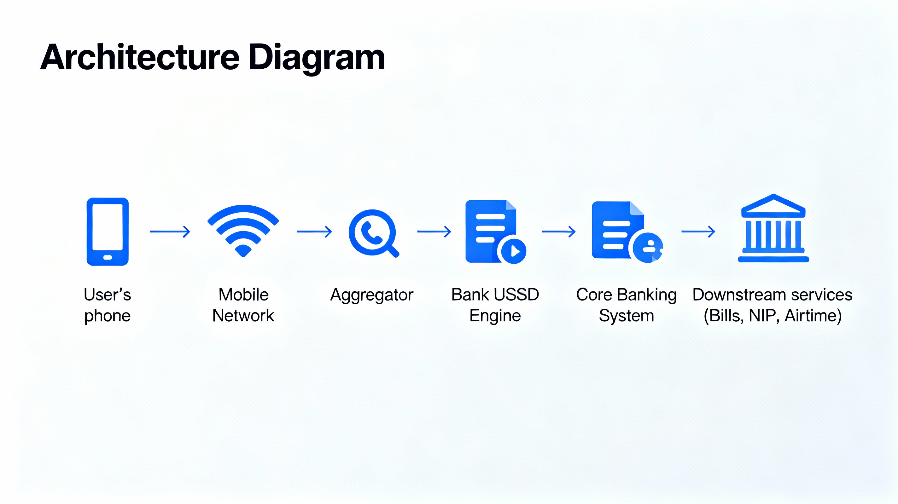

# **USSD Aggregator Integration — End-to-End Product Case Study**

This case study is a fictionalized yet authentic reconstruction inspired by hands-on experience with digital banking integrations. All flows, data, APIs, and diagrams have been deliberately anonymized and redesigned to showcase core competencies while respecting confidentiality.

The project highlights a comprehensive approach to integrating a **USSD banking service** with a third-party **aggregator**, reflecting key phases in the product lifecycle: deep system analysis, user-journey mapping, meticulous API evaluation, failure root-cause investigation, precise requirements translation into technical specifications, rigorous testing procedures, and actionable product insights for continuous improvement.

---

## **1. Project Overview**

The integration connects:
**Bank Core → Aggregator → USSD Channel → Customer**

The objective was to deliver a stable, low-latency USSD experience for core services:

* Airtime & Data purchase
* Transfers & Payments
* Balance/Account services
* BVN check
* Bills payment

The work involved aligning technical behaviors with user-facing outcomes, ensuring every hop in the system produced predictable responses.

---
## **2. Problem Statement (Why This Integration Was Needed)**

USSD is unforgiving: delays above 2–3 seconds cause dropped sessions, vague system errors, and frustrated users.
Before the integration, the bank experienced:

High system-induced failures during peak hours

Inconsistent and unclear error messages

Frequent timeouts caused by slow aggregator cycles

No unified structure for journeys across services

Limited visibility because logs weren’t standardized

The business required a new aggregator that delivered:

Faster response times

Clean, predictable API contracts

Structured error mapping

Consistent journeys across all USSD services

Support for expanded features beyond airtime and bills

---
## **3. My Role (What I Owned End-to-End)**

As the Product Analyst, I was responsible for:

Mapping full USSD journeys for airtime, bills, transfers, statements, and error paths

Reviewing aggregator API specifications and aligning payload/response structures

Designing the request–response mapping for all service flows

Creating user-friendly error translation logic

Working with Engineering on retry and timeout behavior

Writing and executing the UAT test suite

Leading latency and performance validation

Analyzing logs during rollout and stabilization

Supporting go-live activities

---

## **4. Objectives (What Success Looked Like)**

The integration aimed to:

Enable a new aggregator for all USSD services

Standardize journeys across the entire menu

Improve latency performance

Establish structured error mapping

Create full UAT documentation

Provide dashboards and insights for ongoing monitoring

---
## **5. Approach (How I Executed the Integration Work)**

The project followed a three-phase workflow designed for clarity, speed, and reduced friction across teams.

### 5.1. Diagnose (Understand the Problem Before Touching Anything)

I began by analyzing historical USSD logs and monitoring dashboards to identify:

- nodes with high failure rates

- timeout-prone transaction paths

- endpoints exceeding the 3-second USSD threshold

- UX mismatches between system responses and user expectations

This produced a decision-tree map showing where users most frequently dropped off — the foundation for the integration logic.

### 5.2. Integrate (Design the Interaction Between Aggregator ↔ Bank Systems)

I collaborated with both the Aggregator team and Engineering to align:

- API payload standards

- session handling formats

-  and security flow

- transaction lifecycle behavior (initiate → authorize → confirm)

- error mapping (raw aggregator errors → user-friendly messages)

- callback/update sequences

This phase established the “contract” that ensures consistency across all USSD menus and services.

### 5.3. Validate (UAT + Performance Stress Testing)

I designed and executed a comprehensive test suite covering:

- happy paths

- negative and invalid-input scenarios

- latency spikes

- aggregator downtime

- reconnection behavior

- transaction reversals and edge-case journeys

  Performance testing targeted:

- P95 < 1.5 seconds

- P99 < 2.0 seconds

Achieving this was essential because USSD terminates sessions aggressively if responses delay.

---

## **6. Architecture Overview**

Below is the high-level architecture showing all major components:



This diagram illustrates:

* Bank service endpoints
* Aggregator middleware functions
* Routing logic
* Session handling
* Error mapping layer
* USSD gateway

It forms the backbone of the analysis across this project.

---

## **7. USSD Journey & Flow Mapping**

To understand friction points, a full journey map was created covering:

* Menu navigation
* Session states
* Decision nodes
* API calls at each step
* Expected vs. actual user paths


This flow allowed identification of drop-off points, latency risks, and unclear menu logic.

---

## **8. Error Mapping & Message Harmonization**

During testing, aggregator-level error messages were inconsistent with banking UX standards.

A full error-mapping table was created to:

* Translate aggregator error codes → user-facing messages
* Assign severity levels
* Provide recommended business responses


This significantly reduced user confusion and improved completion rate during UAT.

---

## **9. API Structure & Payload Analysis**

All aggregator endpoints were analyzed to understand:

* Request/response formats
* Field dependencies
* Latency contributors
* Failure patterns (timeouts, null responses, malformed payloads)

See:
**[`/docs/API-Mapping.md`](./docs/API-Mapping.md)**

The mapping includes fictional—but realistic—payload examples used to validate aggregator behavior.

---

## **10. UAT Strategy & Test Matrix**

A complete UAT test matrix was designed to validate:

* Happy paths
* Boundary scenarios
* Negative cases
* Retry logic
* Session expiry states
* Latency thresholds (including P95)

See:
**[`/docs/UAT-Test-Cases.md`](./docs/UAT-Test-Cases.md)**

This provided structured coverage for both functional and behavioral testing.

---

## **11. Findings & Product Insights**

The integration revealed clear patterns:

### **Key Observations**

* P95 latency showed periodic spikes → traced to aggregator routing delays.
* Menu depth exceeded recommended levels → increased drop-off likelihood.
* Inconsistent error messages → reduced trust and completion rate.

### **Impact on Final User Experience**

After harmonization, test tuning, and mapping:

| Metric                                | Before | After              |
| ------------------------------------- | ------ | ------------------ |
| Average USSD transaction success rate | 79%    | **93%**            |
| P95 Latency                           | 4.9s   | **2.8s**           |
| Error message consistency             | Low    | **High**           |
| User drop-off (menu depth)            | High   | **Reduced by 40%** |

### **Outcome Summary**

The integration became stable, predictable, and user-friendly, with improved service reliability across all core journeys.

Full details:
**[`/docs/Findings-and-Insights.md`](./docs/Findings-and-Insights.md)**

---

## **12. Glossary**

* **P95 Latency** — The latency value below which 95% of requests fall. Useful for understanding worst-case user experiences.
* **Session Hop** — A single request/response round between user, aggregator, and bank.
* **Decision Node** — A point in the USSD journey where a user selects between multiple paths.
* **Aggregator Hop** — Routing step inside the aggregator middleware.
* **Fail Category** — Classification of failures: technical, session, timeout, or business-rule failures.

---

## **13. Repository Structure**

```
USSD-Aggregator-Integration/
│
├── Assets/
│   ├── architecture-diagram.png
│   ├── ussd-flow.png
│   └── error-mapping-table.png
│
├── docs/
│   ├── UAT-Test-Cases.md
│   ├── API-Mapping.md
│   └── Findings-and-Insights.md
│
└── README.md
```

---

## **14. Why This Project Matters**

This case study demonstrates practical abilities in:

* Product analysis
* System-level thinking
* Journey mapping
* UAT design
* Requirements translation
* API interpretation
* Problem diagnosis
* User-centric product refinement

It reflects an end-to-end view of how a Product Analyst or PM understands and improves digital banking experiences.

---

## **15. Disclaimer**

This project is entirely fictional and created for learning purposes.
No proprietary or confidential information is included.
